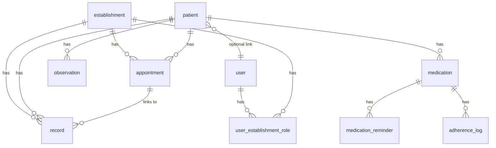

# Project Ivy — Data Model (Rough)

**Living document.** This is an initial schema sketch and will be updated as the project builds (e.g. when auth is added, when new entities or fields are introduced). Add or rename columns and tables as you implement; migrations (e.g. Alembic) will be introduced when the first real schema is created.

See also: [SYSTEM_DESIGN.md](SYSTEM_DESIGN.md), [ARCHITECTURE.md](ARCHITECTURE.md), [RAW_IDEAS.md](RAW_IDEAS.md).

---

## Scope

- **Dev database:** SQLite. Schema is described in a DB-agnostic way (SQLAlchemy-friendly) so it can move to PostgreSQL later.
- **Model:** Normalized relational model with **establishment** and **patient** as first-class entities. Tenant-scoped tables carry `establishment_id`. Use audit fields and optional soft deletes where useful for compliance.

---

## Conventions

- **Tenant isolation:** Every establishment-scoped table has `establishment_id` (FK to `establishment`). All establishment-scoped queries MUST filter by the current establishment.
- **Audit:** Use `created_at` and `updated_at` on key tables; add `deleted_at` where soft deletes are needed.
- **Naming:** Singular table names (e.g. `establishment`, `patient`, `record`), snake_case columns, FKs like `establishment_id`, `patient_id`.

---

## Entity relationship (overview)

---

## Table sketches (revisable)

| Table | Purpose | Key columns (besides id, created_at, updated_at) |
|-------|---------|--------------------------------------------------|
| **establishment** | Hospitals/clinics | name, (address optional) |
| **patient** | Person receiving care | name, date_of_birth (optional), user_id (nullable, for future auth) |
| **user** | Placeholder for auth | email (optional); used when RBAC is added |
| **user_establishment_role** | User ↔ establishment ↔ role | user_id, establishment_id, role (e.g. clinician, admin); patient access via patient.user_id |
| **record** | Medical record file (PDF) | establishment_id, patient_id, file_path (reference), file_name, appointment_id (nullable, link to visit) |
| **appointment** | Visit at an establishment | establishment_id, patient_id, scheduled_at, reason, physician_name |
| **medication** | Prescribed/entered med | patient_id, name, instructions (text), is_active, (establishment_id optional for “prescribed at”) |
| **medication_reminder** | Reminder for a med | medication_id, time_of_day (or cron-like), (recurrence) |
| **adherence_log** | Daily “taken” tracking | medication_id, date, taken_at (or boolean); supports streaks |
| **observation** | Monitoring data point | patient_id, metric_type (string or FK to metric_type), value (or value_numeric + unit), observed_at, source (manual/device), device_id (nullable), (establishment_id optional) |
| **metric_type** (optional for MVP) | Normalize BP, weight, etc. | code (e.g. blood_pressure, weight), display_name, (schema for fields for templates later) |
| **insight** (or **ai_insight**) | Proactive alerts | patient_id, title, body, type, created_at, read_at (nullable) |

---

## Relationships

- **Patient ↔ Establishment:** In the minimal version there is no separate “enrollment” table; association is inferred from the presence of records or appointments. Add an explicit enrollment table later if you need “patient linked to establishment without a visit yet.”
- **Record ↔ Appointment:** `record.appointment_id` links a record to a visit; one appointment can have many records.
- **Observation:** Keyed by patient; optional `establishment_id` if you want to attribute monitoring to a facility. The ingestion API can accept `metric_type` as a string (e.g. `blood_pressure`) and store as-is for MVP; normalize to a `metric_type` table when you add templates.
